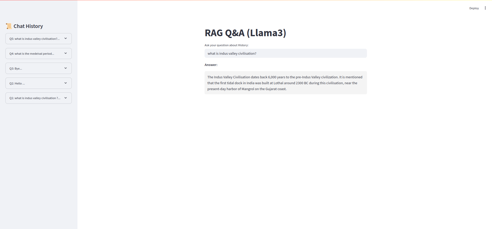

# RAG Q/A Chatbot

# Project Overview 
This project involves scraping Historical documents from Wikipedia, extracting relevant details, scrape the data and storing the scrapped data, embedding it into a vector database (Weaviate), and using a retrieval-augmented generation (RAG) pipeline with a chatbot for querying the stored information. Additionally, the chatbot responses are evaluated using various metrics like rouge_score, cosine_similarity, bert_score_f1 and other parameters like faithfulness, answer_relevancy, context_precision, context_recall.

# 1. Web Scrapping

## 📌 Features

- Scrapes introductory content from Wikipedia pages.
- Supports retry logic with customizable delay.
- Cleans and filters paragraph text.
- Logs scraping and saving activities to a log file.
- Stores all data in a specified directory.

---

## 🛠️ Technologies Used

* **Python 3**
* `requests` – HTTP requests to fetch web content
* `BeautifulSoup` – HTML parsing and data extraction
* `os`, `re`, `time` – File handling, regex parsing, and delays

---

## ⚙️ Workflow

1. **Fetch Wikipedia Page**
   The script makes a request to the Wikipedia page listing

2. **Extract Table Data**
   Locates the correct table by identifying headers that contain topics.

4. **Scrape Specific Pages**

   * Extracts and cleans full-text content by removing unwanted whitespace and references
   * Saves the content as a `.txt` file named

---

## 🧩 Key Functions

### `@staticmethod clean_text(text)`
Cleans a given text by:
- Removing extra spaces.
- Joining text into a single line for consistent formatting.

---

### `scrape_page(self, title, retries=3, delay=2)`
Fetches and parses the main content of a given Wikipedia page.
- Retries the request up to `retries` times if it fails.
- Waits for `delay` seconds between retries to prevent overload.

---

### `save_to_file(self, file_path, content)`
Saves the cleaned content into a file:
- Encoded in UTF-8.
- Creates parent directories if they do not exist.

---

### `scrape_all(self)`
Runs the complete scraping process:
- Iterates through all provided topics.
- Scrapes each corresponding Wikipedia page.
- Appends results and saves them to a final text file.

---

# 2. Text Chunking & Embedding Pipeline

This module processes large text files by splitting them into chunks, embedding those chunks, and storing the results in a **Weaviate** vector database for efficient semantic retrieval.

---

## Features

- Split scraped Wikipedia text into meaningful chunks.
- Generate vector embeddings using **Sentence Transformers**.
- Store the embeddings in **Weaviate** for fast and intelligent retrieval.

---

## Technologies Used

- [Weaviate](https://localhost:8080/)
- `langchain.text_splitter.RecursiveCharacterTextSplitter`
- [sentence-transformers]

---

## Workflow

1. **Load Text Files**  
   Reads and processes `.txt` files from a designated folder.

2. **Split Text into Chunks**  
   Uses `RecursiveCharacterTextSplitter` to divide text into:
   - Chunks of 800 characters
   - With 100-character overlaps for better context retention

3. **Embed Text Chunks**  
   - Leverages **SentenceTransformer** to convert each chunk into vector embeddings.
   - Prepares the data for insertion into the vector store.

4. **Store in Weaviate**  
   - Checks if the collection exists.
   - Creates a new one if needed.
   - Inserts embedded text chunks for retrieval.

---

## Key Functions

### `load_text()`
Reads all `.txt` files in the specified folder and loads their content.

---

### `split_text_semantic(text)`
Uses `RecursiveCharacterTextSplitter` to break long text into manageable chunks:
- Chunk size: 800 characters  
- Overlap: 100 characters

---

### `insert_chunks(chunks)`
Embeds the text chunks using SentenceTransformer and stores them in Weaviate.

---

# 3. RAG Bot

## Purpose

- Query stored text information using a chatbot powered by **Retrieval-Augmented Generation (RAG)**.
- Retrieve relevant chunks from a vector database and generate coherent, contextual responses.

---

## Technologies Used

- [Streamlit](https://streamlit.io/)
- [Weaviate](https://localhost:8080/)
- [Sentence Transformers]
- [Ollama](https://ollama.com/) (for Llama 3)
- Gemini (Google's LLM)

---

## Workflow

1. **User Input**  
   Accepts a user query from the Streamlit-based chatbot interface.

2. **Query Weaviate**  
   Converts the input into an embedding using SentenceTransformer.  
   Performs a **vector similarity search** to fetch contextually relevant chunks.

3. **Generate Response**  
   - Constructs a prompt using the retrieved context.
   - Sends the prompt to **Llama 3** via `LlamaQuerier.query()` or to **Gemini**.
   - Displays the generated response in the Streamlit UI.

---

## Key Components

- `streamlit` UI: Simple frontend for users to interact with the chatbot.
- `model.encode(user_input)`: Embeds the query for similarity search.
- `documents.query.near_vector()`: Retrieves top-k similar chunks from Weaviate.
- `LlamaQuerier.query()`: Calls Llama 3 to generate a response.

---

## UI 

# 4. Evaluation

## Feature

- Automatically measure and analyze the **faithfulness**, **answer_relevancy** , **context_precision**, and **context_recall** of chatbot responses.
- Compare generated answers to expected outputs using custom evaluation method.

---

## Technologies Used

- [rouge-score](https://github.com/google/rouge) – ROUGE Score
- [sentence-transformers](https://www.sbert.net/) – Semantic Similarity
- BERT F1 Score
- [Weaviate](https://localhost:8080/) – Vector search
- [Ollama](https://ollama.com/) – Llama 3 integration

---

## Workflow

1. **Load Dataset**  
   Reads a JSON file containing question-answer pairs as ground truth.

2. **Retrieve Relevant Context**  
   Uses Weaviate to perform vector similarity search and extract the most relevant chunks.

3. **Generate Chatbot Response**  
   Sends a prompt to Llama 3 (via Ollama) or Gemini to generate an answer based on the context.

4. **Evaluate Metrics**  
   Compares the generated answer to the expected one using multiple metrics:
   - **ROUGE Score** – Measures precision and recall of overlapping text.
   - **Semantic Similarity** – Cosine similarity between vector embeddings.
   - **BERT F1** – Token-level overlap using BERT.
   - **F1 Score** – Harmonic mean of precision and recall.

5. **Store Evaluation Results**  
   Logs metric values for performance comparison and tracking.

---

# Conclusion 
This project successfully integrates web scraping, vector search, and LLM-based chatbot functionalities to provide an interactive knowledge retrieval system. By leveraging Weaviate for efficient storage and retrieval, along with an evaluation pipeline, the system ensures high-quality responses with measurable accuracy.

<!-- ### `get_unicorn_startups()`

* Extracts startup details and links from the Wikipedia unicorn list page.
* Returns a list of dictionaries, one per startup.

### `scrape_startup_page(startup, index)`

* Visits the startup’s Wikipedia page using the link.
* Parses, cleans, and saves the content to a `.txt` file.

### `scrape_unicorns()`

* Driver function that coordinates:

  * Table scraping
  * Iterating over startups
  * Company page scraping and file saving

--- -->
